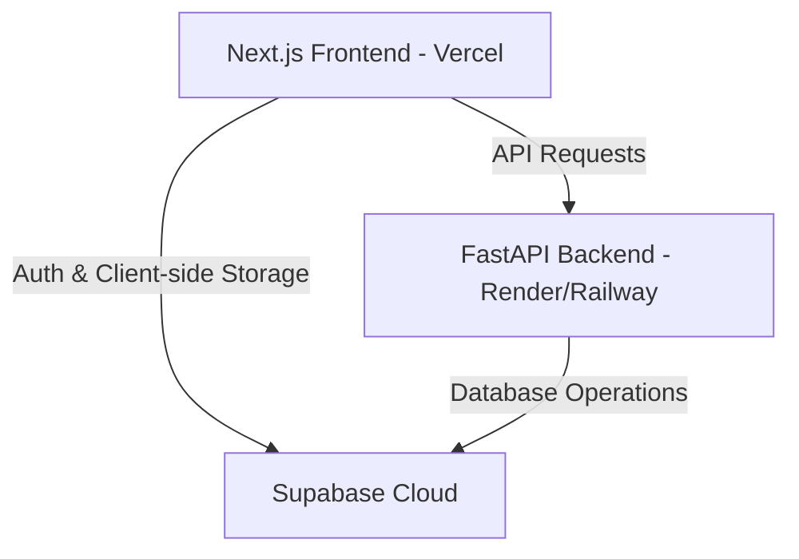

# 🌐 Deployment Guide

This guide walks you through deploying the **AI Resume Builder & ATS Matcher** stack to production.

---

## 🏗️ Deployment Architecture



---

## 1. 🗄️ Database & Authentication Setup (Supabase)

1. **Create a Supabase Project**:
   - Go to [supabase.com](https://supabase.com) and create a new project.
2. **Execute Database Setup**:
   - Navigate to the **SQL Editor** in the Supabase Dashboard.
   - Click **New Query**, paste the contents of `supabase_setup.sql` (found in the root of the project), and click **Run**. This will create the `resumes` table with Row Level Security (RLS) policies.
3. **Configure Authentication**:
   - Go to **Authentication > Providers** and ensure **Email** is enabled.
   - Adjust the email confirmation templates or disable confirmation emails for testing purposes.

---

## 2. 🐍 Backend API Deployment (Render / Railway)

Because the backend uses **Playwright** to render PDFs with headless Chromium, deploying via a **Docker Container** is the most reliable method. It guarantees that all Chromium system dependencies are correctly installed.

### Option A: Deploying on Render (Recommended)
1. **Create Web Service**:
   - Sign in to [Render](https://render.com) and click **New > Web Service**.
   - Connect your GitHub repository.
2. **Configure Settings**:
   - **Root Directory**: `backend` (or leave empty if connecting a backend-only repo).
   - **Runtime**: Select **Docker**.
3. **Add Environment Variables**:
   Navigate to **Environment** and add:
   ```env
   SUPABASE_URL=https://your-project-id.supabase.co
   SUPABASE_ANON_KEY=your-supabase-anon-key
   GROQ_API_KEY=your-groq-api-key
   FRONTEND_URL=https://your-frontend-domain.vercel.app
   ```
4. **Deploy**:
   - Click **Deploy Web Service**. Render will build the container from the `backend/Dockerfile` and start the service.

### Option B: Deploying on Railway
1. **New Project**:
   - Go to [Railway.app](https://railway.app) and click **New Project > Deploy from GitHub**.
2. **Select Repo**:
   - Select your repository and choose the `backend` path. Railway will automatically detect the `Dockerfile` and build it.
3. **Variables**:
   - Add the same environment variables list as above under the **Variables** tab.

---

## 3. ⚛️ Frontend Next.js Deployment (Vercel)

1. **Create Vercel Project**:
   - Sign in to [Vercel](https://vercel.com) and click **Add New > Project**.
   - Select your GitHub repository.
2. **Configure Build Settings**:
   - **Framework Preset**: Next.js
   - **Root Directory**: `frontend`
3. **Add Environment Variables**:
   Expand the environment variables section and add:
   ```env
   NEXT_PUBLIC_SUPABASE_URL=https://your-project-id.supabase.co
   NEXT_PUBLIC_SUPABASE_ANON_KEY=your-supabase-anon-key
   NEXT_PUBLIC_API_URL=https://your-backend-render-url.onrender.com
   ```
4. **Deploy**:
   - Click **Deploy**.

---

## 📋 Environment Variables Checklist

Ensure these variables match in production:

### Backend Variables (`backend/.env`)
| Key | Description | Example |
| :--- | :--- | :--- |
| `SUPABASE_URL` | Your Supabase project URL | `https://xxxx.supabase.co` |
| `SUPABASE_ANON_KEY` | Your Supabase public anonymous API key | `sb_publishable_xxxx` or `eyJhb...` |
| `GROQ_API_KEY` | API Key for LLama model execution | `gsk_xxxx` |
| `FRONTEND_URL` | Production URL of your Next.js frontend (for CORS) | `https://your-app.vercel.app` |

### Frontend Variables (`frontend/.env.local` / Vercel Environment)
| Key | Description | Example |
| :--- | :--- | :--- |
| `NEXT_PUBLIC_SUPABASE_URL` | Your Supabase project URL | `https://xxxx.supabase.co` |
| `NEXT_PUBLIC_SUPABASE_ANON_KEY` | Your Supabase public anonymous API key | `sb_publishable_xxxx` or `eyJhb...` |
| `NEXT_PUBLIC_API_URL` | The production URL of your FastAPI backend | `https://your-backend-url.com` |
